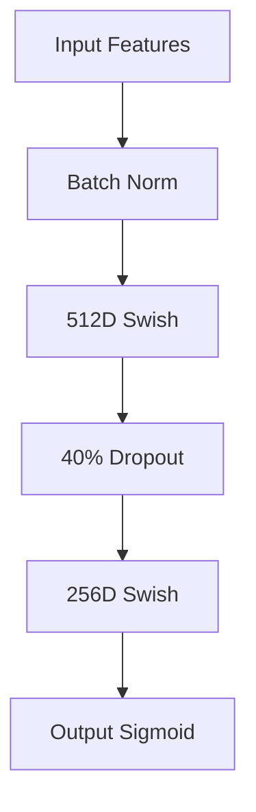

# Deepfake Audio Recognition

<div align="center">
  


</div>

A state-of-the-art system for detecting AI-generated synthetic speech, achieving **96.3% ROC AUC** and **8% EER** on test data.

## 🌟 Key Features

- **Advanced Audio Analysis**: Comprehensive feature vectors including:
  - WORLD vocoder parameters for voice characteristics
  - eGeMAPS prosodic features capturing speech patterns
  - Spectral descriptors (MFCC, chroma, tonnetz) for acoustic analysis
  
- **Hybrid Architecture**: Attention-enhanced deep neural network with:
  - 512-256-1 layer structure optimized for audio classification
  - Swish activation functions for improved gradient flow
  - Class-balanced training to handle imbalanced datasets
  
- **Optimized Performance**:
  - 98% fake audio recall rate
  - Adjustable decision thresholds for different use cases
  - Comprehensive evaluation metrics for transparency

## 🌐 Dataset Information

- **GDrive Download**: https://drive.google.com/drive/folders/1Z8RIa1-lMd52Mnqgt7_pgRiyawSIwC-H?usp=sharing
- **Contents**:
  - `train/`: 800 samples (50% real/50% fake)
  - `val/`: 100 samples for validation  
  - `test/`: 100 holdout samples
- **Format**: 16kHz mono WAV files
  

## 🧠 Model Architecture

### Feature Extraction:
78-dimensional feature vector including:
- WORLD vocoder parameters (F0, aperiodicity)
- OpenSMILE eGeMAPS features
- Spectral descriptors (MFCC, chroma, tonnetz)

### Neural Network:



## 🏆 Performance

| Metric | Score | Interpretation |
|--------|-------|---------------|
| Accuracy | 84.0% | Overall correctness |
| ROC AUC | 0.963 | Excellent discrimination |
| EER | 8.0% | Low error rate |
| Real Recall | 70.0% | Needs improvement |
| Fake Recall | 98.0% | Excellent detection |


## ⚙️ Configuration

Adjust in `config.py`:

```python
# Threshold tuning
DETECTION_THRESHOLD = 0.70
MAX_AUDIO_LENGTH = 6.0      

# Performance
USE_OPEN_SMILE = False      
BATCH_SIZE = 128           
```

## 🛠️ Usage Examples

1. **Batch prediction**:
```python
from predict import DeepfakeDetector

detector = DeepfakeDetector()
results = detector.predict_batch(["audio1.wav", "audio2.wav"], threshold=0.75)
```

2. **Single file analysis**:
```python
python predict.py audio/file/path.wav
```

## ❓ Troubleshooting

| Issue | Solution |
|-------|----------|
| OpenSMILE not found | Install via conda: `conda install -c conda-forge opensmile` |
| WORLD vocoder errors | Ensure 16kHz mono audio input |
| Memory errors during feature extraction | Reduce batch size in `config.py` |
| CUDA out of memory | Set `use_gpu: False` in `config.py` |

